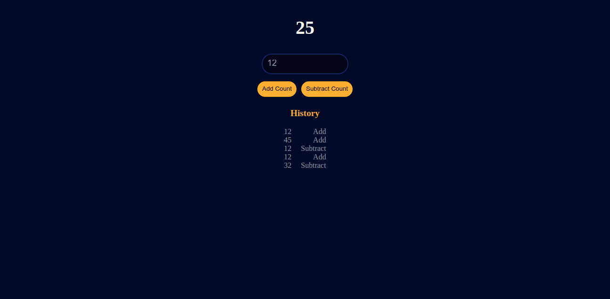

<!-- ABOUT THE PROJECT -->
# Counter App

Simple Counter for add and subtract a number and maintain a history

Home Page

### Built With

* [Next.js](https://nextjs.org/)

### Prerequisites

* [nodejs](https://nodejs.org/en/download/) and [npm](https://classic.yarnpkg.com/en/)

## How to run in your Local environment

<dl>
    <dt>Step1: Clone GitHub Project on your PC</dt>
    <dd>
        
git clone https://github.com/nayanrdeveloper/bitcrunch_assignment.git

    </dd>
    <dt>Step - 2: </dt>
    <dd>
        
npm install

        
npm run dev

        
Open your Project in browser (http://localhost:3000/)

    </dd>
</dl>
